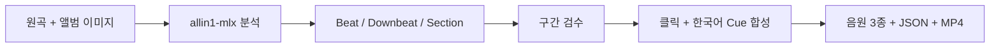
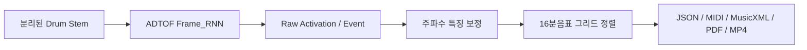
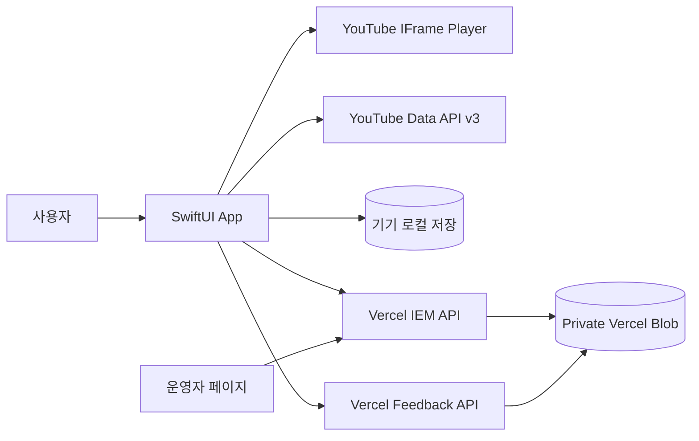

<div align="center">
  
  <h1>BandLoop</h1>
  <p><strong>원하는 구간만, 바로 반복.</strong><br />밴드 합주와 악기 카피를 위한 iPhone·iPad 연습 앱</p>
  <p>
    
    
    
    
  </p>
  <p>
    <a href="https://band-loop.vercel.app">Website</a> ·
    <a href="https://band-loop.vercel.app/support">Support</a> ·
    <a href="https://band-loop.vercel.app/privacy">Privacy</a>
  </p>
</div>


## 만든 이유

밴드 연습 중에는 같은 10초를 몇 번이고 다시 듣습니다. 그런데 YouTube에서는 시작점을 다시 찾고, 배속을 맞추고, 화면을 돌릴 때마다 조작을 반복해야 했습니다.

BandLoop는 이 과정을 줄이기 위해 시작했습니다. 연습할 구간을 한 번 저장하고, 다음 연습에서 그대로 이어서 재생하는 것이 핵심입니다.

**1인 프로젝트**로 문제 정의, 화면 설계, iOS 개발, 서버 구조, 실기기 테스트를 직접 진행했습니다. 현재 iOS 앱은 App Store Connect에 업로드한 상태입니다.

## 기능

| 기능 | 내용 |
| --- | --- |
| 영상 불러오기 | YouTube 링크 붙여넣기 또는 앱 내 검색 |
| A–B 반복 | 시작점과 끝점을 찍고 0.5초 단위로 보정 |
| 구간 저장 | 영상당 최대 10개, 이름 변경·삭제 |
| 최근 연습 | 링크·재생 위치·배속·반복 구간을 최대 20개까지 로컬 저장 |
| 인이어 연습곡 | 운영자가 추가한 YouTube 연습곡을 앱에서 재생 |
| 셋리스트 | 곡 선택, 순서 변경, 공연용 이전·다음·다시 재생 |
| iPad·가로 화면 | 영상을 크게 보되 필요할 때만 조절 사이드바를 표시 |
| 개선 제안 | 앱에서 의견을 입력하면 비공개 피드백함으로 전송 |

<table>
  <tr>
    <td width="50%"></td>
    <td width="50%"></td>
  </tr>
</table>

## 인이어 제작 도구

앱을 만들고 나니 공연 연습에서 쓸 인이어 음원도 같은 목록에서 재생하고 싶었습니다. 그래서 `Studio/`에 원곡을 분석하고, 클릭과 한국어 구간 안내를 넣어 영상까지 만드는 Python 도구를 추가했습니다.



- `allin1-mlx`의 사전학습 모델로 beat·downbeat·section을 분석합니다.
- 분석 결과는 초안으로 두고, 검수한 cue JSON으로 구간을 수정할 수 있게 했습니다.
- BPM이 고정된 곡은 `--fixed-bpm`으로 클릭 밀림을 줄일 수 있습니다.
- 48 kHz 원곡+guide, guide-only, music-left/guide-right 음원과 timeline JSON, 1080p MP4를 생성합니다.

## 드럼 악보 실험

처음에는 ADTOF Frame_RNN이 낸 kick·snare·tom·hi-hat·cymbal 5개 결과만으로 악보를 만들었습니다. 하지만 실제 드럼 악보처럼 탐과 라이드·크러시가 구분되지 않아 연주에 쓰기 어려웠습니다.

그래서 모델은 onset 검출에 사용하고, 각 onset 주변의 주파수 특징을 다시 분석해 탐 위치와 심벌 종류를 보정하는 방식으로 바꾸었습니다.

- 20초 chunk와 2초 context로 긴 음원을 나눠 추론합니다.
- 최종 파일만 남기지 않고 raw activation·event를 함께 저장해 오탐지를 다시 확인할 수 있게 했습니다.
- 박자 분석 결과의 16분음표 그리드에 맞춘 뒤 JSON·MIDI·MusicXML·PDF·스크롤 MP4로 출력합니다.



### 현재 한계

이 도구는 새 모델을 학습한 연구 프로젝트가 아니라, 사전학습 모델을 실제 제작 흐름에 연결해 본 프로토타입입니다. 섹션 경계, 심벌 종류, 오픈 하이햇, 고스트 노트는 여전히 사람의 검수가 필요합니다.

정확도를 숫자로 말하려면 평가 데이터가 먼저 필요합니다. 다음 단계는 짧은 음원을 직접 라벨링해 onset Precision·Recall·F1과 timing error를 측정하는 것입니다. 현재는 해당 지표가 없으므로 성능을 과장하지 않습니다.

자세한 실행 방법은 [Studio README](Studio/README.md)에 정리했습니다.

## 앱과 운영 서버



최근 영상·저장 구간·셋리스트는 개인 설정이므로 기기에 저장합니다. 반면 인이어 목록은 계속 늘어나야 하므로 Vercel API로 분리했습니다. 새 곡을 추가할 때마다 앱을 다시 심사받지 않기 위한 선택입니다.

앱 내부의 책임 분리는 [Architecture](docs/ARCHITECTURE.md)에서 확인할 수 있습니다.

## 저장소 구성

```text
BandLoop/
├── BandLoop/             # iPhone·iPad 앱
│   ├── IEM/              # 인이어 목록·셋리스트·공연 재생
│   ├── Player/           # YouTube 재생·반복 제어
│   ├── Search/           # YouTube Data API 검색
│   └── Stores/           # 최근 영상과 연습 상태
├── BandLoopTests/        # iOS 단위 테스트
├── Studio/
│   ├── Configs/          # 검수한 cue 예시
│   └── Scripts/          # 음원 분석·믹싱·악보·영상 생성
├── Website/              # 소개·지원 페이지와 Serverless API
├── Design/               # 앱 아이콘과 App Store 이미지
└── docs/                 # 설계 문서
```

## 로컬 실행

### iOS

Xcode 26+, iOS 17+, YouTube Data API v3 키가 필요합니다.

```bash
cp Config/Secrets.example.xcconfig Config/Secrets.xcconfig
open BandLoop.xcodeproj
```

`Config/Secrets.xcconfig`에 `YOUTUBE_API_KEY`를 입력한 뒤 iPhone 또는 iPad에서 실행합니다. 실제 키와 운영자 비밀번호는 Git에 커밋하지 않습니다.

### Studio

macOS `say`, FFmpeg/ffprobe, Python 3와 모델 의존성이 필요합니다.

```bash
python3 Studio/Scripts/make_iem_video.py \
  /path/to/song.mp3 \
  /path/to/album-image.jpg \
  --title "Song title" \
  --artist "Artist" \
  --slug song-title
```

## 검증

```bash
xcodebuild -project BandLoop.xcodeproj \
  -scheme BandLoop \
  -sdk iphonesimulator \
  -destination 'generic/platform=iOS Simulator' \
  -derivedDataPath /tmp/BandLoopDerivedData \
  CODE_SIGNING_ALLOWED=NO build

cd Website && npm run check
python3 -m compileall Studio/Scripts
```

Copyright © 2026 BandLoop. All rights reserved.
