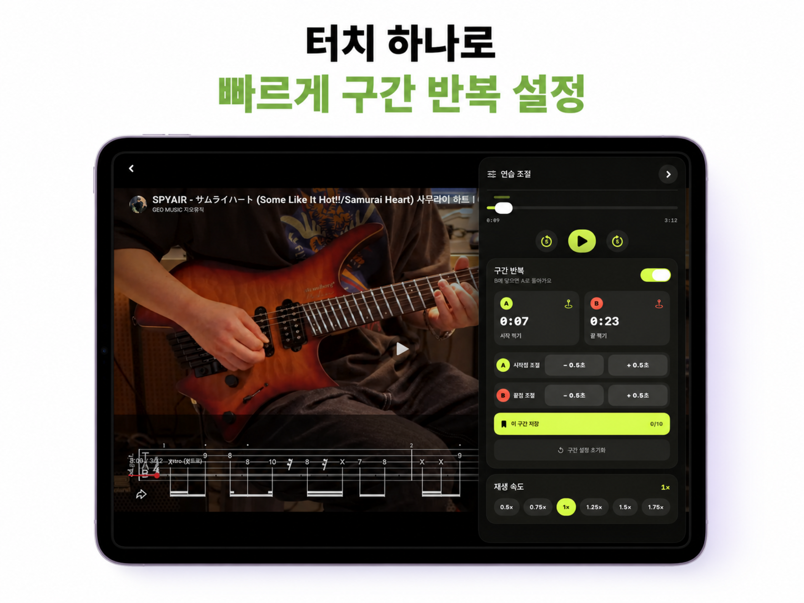
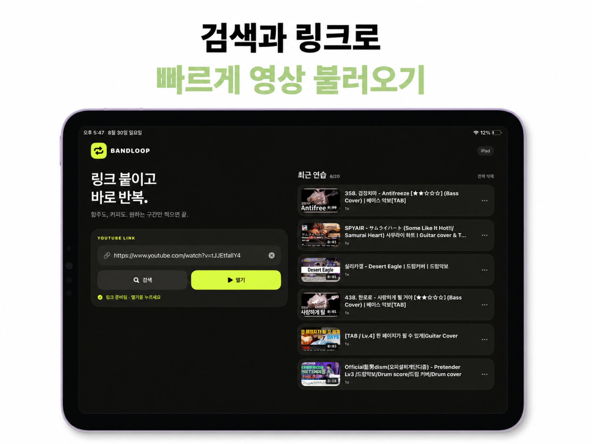
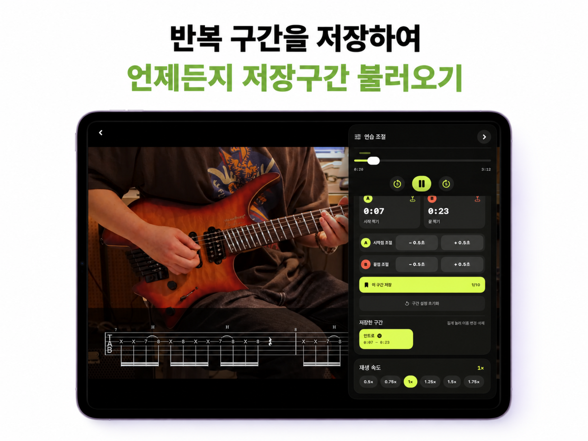
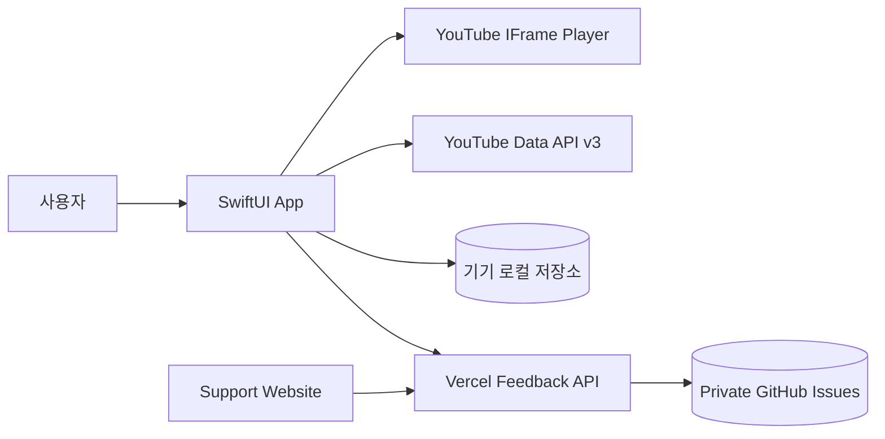

<div align="center">
  
  <h1>BandLoop</h1>
  <p><strong>원하는 구간만, 바로 반복.</strong><br />밴드 합주와 악기 카피를 위해 만든 iPhone·iPad 네이티브 연습 앱</p>
  <p>
    
    
    
    
  </p>
  <p>
    <a href="https://band-loop.vercel.app">Website</a> ·
    <a href="https://band-loop.vercel.app/support">Support</a> ·
    <a href="https://band-loop.vercel.app/privacy">Privacy</a>
  </p>
</div>



## 왜 만들었나요?

연주 영상을 따라 할 때마다 재생바를 되감고, 정확한 시작점을 다시 찾고, 배속을 다시 맞추는 흐름을 줄이고 싶었습니다. BandLoop는 유튜브 영상을 새로운 방식으로 소비하기보다 **반복 연습에 필요한 조작만 빠르고 크게 제공하는 것**에 집중합니다.

> 기능을 더하기 전에, 한 번 덜 누르게 만들기.

## 핵심 기능

| 기능 | 경험 |
| --- | --- |
| 빠른 영상 불러오기 | 링크 붙여넣기 또는 앱 내 YouTube 검색 |
| 직관적인 A–B 반복 | 재생 중 시작점 A와 끝점 B를 터치해 즉시 반복 |
| 정밀한 구간 조절 | 시작·끝 지점을 0.5초 단위로 보정 |
| 영상별 구간 저장 | 영상마다 최대 10개, 길게 눌러 이름 변경·삭제 |
| 재생 속도 | 0.5×부터 2×까지 선택하고 영상별로 기억 |
| 최근 연습 | 링크, 마지막 위치, 배속, 반복 구간을 최대 20개까지 로컬 저장 |
| 가로 연습 모드 | 영상을 크게 유지하고 필요할 때만 조절 사이드바 표시 |
| 개선 제안 | 앱에서 내용만 입력하면 비공개 피드백함으로 바로 접수 |

## 화면

<table>
  <tr>
    <td width="50%"></td>
    <td width="50%"></td>
  </tr>
  <tr>
    <td align="center"><strong>빠른 영상 불러오기</strong></td>
    <td align="center"><strong>영상별 저장 구간</strong></td>
  </tr>
</table>

## 시스템 구조



- 앱은 SwiftUI 기반 단일 타깃으로 iPhone과 iPad 레이아웃을 함께 제공합니다.
- `HistoryStore`가 최근 영상과 영상별 연습 상태를 로컬에 저장합니다.
- `YouTubePlayerController`가 재생·탐색·배속·반복 상태를 SwiftUI에 전달합니다.
- 소개·지원·개인정보 페이지와 피드백 API는 `Website/`에서 함께 Vercel에 배포됩니다.
- 개선 제안용 GitHub 토큰은 앱이나 저장소에 포함하지 않고 Vercel 환경변수에만 둡니다.

더 자세한 책임 분리와 데이터 흐름은 [Architecture](docs/ARCHITECTURE.md)에서 확인할 수 있습니다.

## 저장소 구성

```text
BandLoop/
├── BandLoop/                 # iOS 앱
│   ├── Feedback/             # 개선 제안 UI와 API 클라이언트
│   ├── Models/               # 영상·저장 구간 모델
│   ├── Player/               # YouTube 플레이어와 URL 파싱
│   ├── Search/               # YouTube Data API 검색
│   ├── Stores/               # 최근 영상 로컬 저장
│   └── Utilities/            # 회전 및 시간 표현
├── BandLoopTests/            # URL 파싱·저장소 단위 테스트
├── Website/                  # Vercel 정적 사이트 + Serverless API
│   ├── api/feedback.js       # 의견을 비공개 GitHub Issue로 전달
│   └── assets/               # 웹 디자인 자산
├── Design/                   # 앱 아이콘과 App Store 이미지
├── Config/                   # 로컬 빌드 설정 예시
└── docs/ARCHITECTURE.md      # 구조와 설계 결정
```

## 로컬 실행

### 요구 사항

- Xcode 26 이상
- iOS 17 이상
- YouTube Data API v3 키

### 설정

1. 저장소를 복제합니다.
2. `Config/Secrets.example.xcconfig`를 `Config/Secrets.xcconfig`로 복사합니다.
3. `YOUTUBE_API_KEY`에 Google Cloud에서 발급한 키를 입력합니다.
4. 키의 API 제한을 **YouTube Data API v3**로 지정하고 iOS 앱 `com.bandloop.ios` 제한을 적용합니다.
5. `BandLoop.xcodeproj`를 열고 iPhone 또는 iPad에서 실행합니다.

```bash
cp Config/Secrets.example.xcconfig Config/Secrets.xcconfig
open BandLoop.xcodeproj
```

검색 결과를 선택하면 링크만 홈에 입력되며, 사용자가 `열기`를 눌렀을 때 영상을 불러옵니다.

## 검증

앱은 서명 없이 generic iOS Simulator 대상으로 컴파일할 수 있고, URL 파싱과 최근 영상 저장 규칙은 단위 테스트로 확인합니다. 웹은 별도 패키지 설치 없이 JavaScript 구문과 피드백 API의 검증·Issue 생성 요청을 테스트합니다.

```bash
# iOS 빌드
xcodebuild -project BandLoop.xcodeproj \
  -scheme BandLoop \
  -sdk iphonesimulator \
  -destination 'generic/platform=iOS Simulator' \
  -derivedDataPath /tmp/BandLoopDerivedData \
  CODE_SIGNING_ALLOWED=NO build

# 웹과 피드백 API
cd Website && npm run check
```

## 웹사이트와 피드백 배포

Vercel 프로젝트는 저장소 루트에서 배포합니다. 루트의 `vercel.json`이 `Website/`의 정적 페이지와 `api/`의 Serverless Function을 연결합니다. 아래 환경변수를 설정하면 개선 제안이 비공개 GitHub Issues로 전달됩니다.

| 환경변수 | 설명 |
| --- | --- |
| `GITHUB_FEEDBACK_TOKEN` | 피드백 저장소 한 곳에만 `Issues: write`를 가진 fine-grained token |
| `GITHUB_FEEDBACK_OWNER` | 비공개 피드백 저장소 소유자 |
| `GITHUB_FEEDBACK_REPO` | 비공개 피드백 저장소 이름 |

앱과 웹에서 접수한 내용은 이슈 하나로 생성됩니다. 토큰은 `.env`나 소스에 커밋하지 않습니다.

```bash
cd Website && npm run check
cd .. && vercel --prod
```

## 개인정보 원칙

- 계정 생성 없음
- 광고 및 사용자 추적 없음
- 최근 영상과 연습 설정은 기기 내부에 저장
- 개선 제안은 사용자가 보내기를 선택한 경우에만 내용과 앱 버전을 전송
- 현재 재생 영상, 이름, 이메일, 광고 식별자는 개선 제안에 첨부하지 않음

전체 내용은 [개인정보 처리방침](Website/privacy.html)에 정리되어 있습니다.

## 상태

BandLoop 1.0은 iPhone과 iPad 배포를 준비 중입니다. 실제 합주와 개인 연습에서 발견한 마찰을 중심으로 계속 다듬고 있습니다.

## 권리

Copyright © 2026 BandLoop. All rights reserved. 별도의 라이선스가 명시되지 않은 한 소스와 디자인 자산의 재사용 권한을 부여하지 않습니다.
