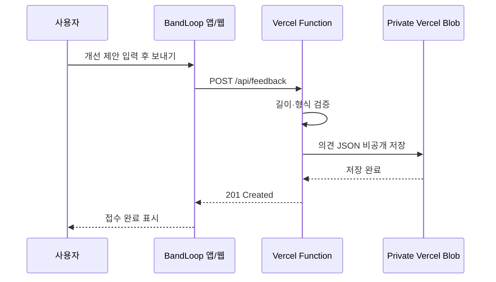

# BandLoop Architecture

BandLoop는 빠른 반복 연습이라는 한 가지 흐름을 중심으로 구성된 SwiftUI 앱입니다. 별도 로그인이나 동기화 서버 없이 핵심 연습 데이터는 기기에 남기고, 외부 네트워크는 YouTube 검색·재생과 사용자가 직접 보내는 개선 제안에만 사용합니다.

## 1. iOS 앱 구성

```text
ContentView
├── HomeScreen
│   ├── YouTube 링크 입력
│   ├── YouTubeSearchScreen
│   ├── 최근 영상 목록
│   └── FeedbackSheet
└── PracticeScreen
    ├── YouTubePlayerView
    ├── A–B 반복 설정
    ├── 저장 구간 관리
    ├── 재생 속도
    └── 가로 화면 조절 사이드바
```

### 책임

- `ContentView`: 홈과 연습 화면의 전환, 현재 영상의 주기적 저장
- `HistoryStore`: 최대 20개의 최근 영상 및 연습 상태 영속화
- `RecentVideo`: 영상 ID, 링크, 마지막 위치, 배속, 활성 반복 구간, 저장한 구간 모델
- `YouTubeURLParser`: 지원되는 YouTube URL에서 영상 ID를 안전하게 추출
- `YouTubeSearchService`: YouTube Data API v3 검색 요청과 응답 변환
- `YouTubePlayerController`: WebView 플레이어 이벤트를 SwiftUI 상태로 변환하고 A–B 반복을 제어
- `FeedbackService`: 익명 개선 제안을 Vercel API로 전송

## 2. 연습 데이터 흐름

1. 사용자가 링크를 열거나 검색 결과를 선택합니다.
2. 기존 영상이면 `HistoryStore`에서 마지막 연습 상태를 복원합니다.
3. 플레이어가 마지막 위치·배속·반복 구간을 적용합니다.
4. 연습 중 상태는 주요 조작과 앱 생명주기 변경 시 저장되며, 재생 위치는 주기적으로 반영됩니다.
5. 앱을 다시 열면 같은 영상에서 이어서 연습할 수 있습니다.

## 3. 반복 구간

- A와 B는 현재 플레이어 시간을 기준으로 기록합니다.
- B는 A보다 최소 0.5초 뒤여야 유효한 구간이 됩니다.
- 유효한 구간에서 현재 시간이 B에 닿으면 플레이어를 A로 이동합니다.
- 저장 구간은 영상에 귀속되며 최대 10개까지 유지합니다.
- 저장 구간의 이름 변경과 삭제는 길게 누르기 메뉴에서 처리합니다.

## 4. 화면 크기와 회전

- 세로 화면은 영상 아래에 타임라인, 재생 조작, 반복과 배속 카드를 배치합니다.
- 가로 화면은 영상을 최대화하고 상단 모서리에 뒤로가기와 조절 진입점만 남깁니다.
- 가로 조절 사이드바는 영상 위에 일시적으로 나타나며 닫으면 영상만 유지됩니다.
- iPad는 regular size class에서 홈 콘텐츠를 2열로 배치합니다.

## 5. 웹과 피드백



비공개 Blob은 Vercel Function에 자동 주입되는 단기 OIDC 인증으로 접근합니다. 장기 저장소 토큰은 앱이나 GitHub 저장소에 포함하지 않습니다. 앱은 이름, 이메일, 영상 링크나 기기 식별자를 전송하지 않습니다.

## 6. 외부 의존성과 실패 처리

- YouTube 영상이 임베드 재생을 금지한 경우 앱에서 우회하지 않고 오류를 표시합니다.
- YouTube 검색 API 키가 없거나 할당량이 소진되면 검색 화면에 재시도 가능한 오류를 표시합니다.
- 피드백 API가 준비되지 않았거나 네트워크 오류가 나면 입력 내용을 유지한 채 재시도 메시지를 보여줍니다.
- 핵심 최근 영상 및 반복 기능은 피드백 서버 상태와 무관하게 작동합니다.

## 7. 검증

- `YouTubeURLParserTests`: 공유 링크와 여러 YouTube URL 형식 파싱 검증
- `HistoryStoreTests`: 최근 영상 수 제한, 갱신과 삭제 검증
- Xcode simulator generic destination 빌드로 iPhone/iPad 공통 컴파일 검증
- `Website`의 JavaScript 구문 및 피드백 함수 동작 검증
